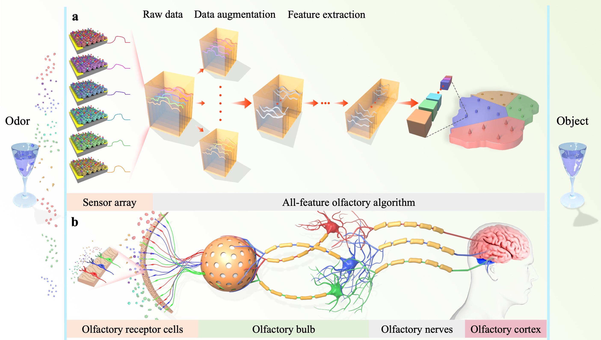

# Smart electronic nose enabled by an all-feature olfactory algorithm (AFOA)      


### Introduction
This repository contains the code of the paper [Smart electronic nose enabled by an all-feature olfactory algorithm (AFOA)](https://onlinelibrary.wiley.com/doi/epdf/10.1002/aisy.202200074). Our method combines one-dimensional convolutional and recurrent neural networks with channel and temporal attention modules to fully utilize complementary global and dynamic information in an end-to-end manner. We further demonstrate that a novel data augmentation method can transform the raw data into a suitable representation for feature extraction. The experimental results show that the smart e-nose simply comprising of six semiconductor gas sensors achieves superior performances to state-of-the-art methods on real-world data. 

<p align="center"></p>

### Prerequisites
* python 3.6
* tensorflow 1.13
* keras 2.2
* numpy
* scikit-learn

### How to Run

**Preparation**.
  1. Modify the dataset path in main.py:

```Shell
tfrecord_file='/home/xxxx/works/E-nose/AFOA/data/
```
  2. Modify the pre-trained model path:

```Shell
pretrained_model_path=/home/xxxx/works/COVID-19/PMP/pretrained_model_dataset1/
```

  3. Copy datasets to your dataset path.
   
   
**Training**.  

For example, train our model on the dataset

```Shell
CUDA_VISIBLE_DEVICES=0 python main.py --batch-size 128 --lstm-hidden 64 --dataset e-nose --res-first-filters 16 --attention-mode cbam2 --epochs 100 --stage-num 3 --pool-size 8 --dropout 0.2 --r-dropout 0.1 --d-dropout 0.05 --sensor 0
```
It will save the models in ```./saved_models/```.
   
   
**Testing**.  

For example, directly evaluate the model trained from dataset.

```Shell
CUDA_VISIBLE_DEVICES=0 python eval.py --dataset e-nose --model-path e-Nose_resnet20_cbam_block_model.106_sensor0_len600.h5 --sensor 0
```
